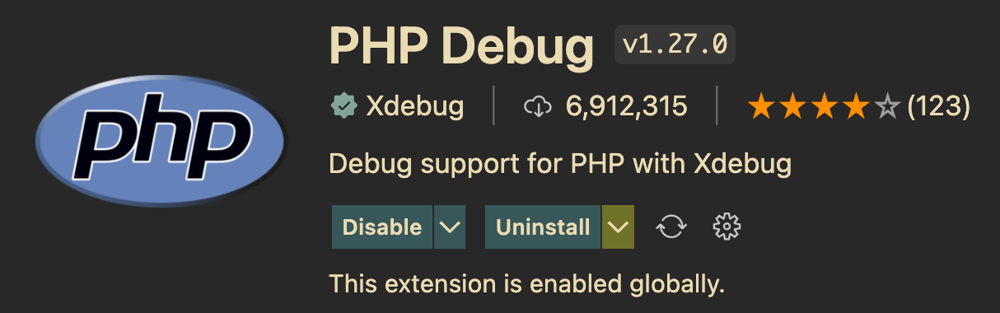

# Install and Configure xDebug through a Vagrant Box

## Install and Configure

Enter these commands in the terminal:

```bash
> sudo apt install php-xdebug
> sudo vim /etc/php/8.1/mods-available/xdebug.ini
```

Add these lines to xdebug.ini:

```conf
xdebug.mode = debug
xdebug.start_with_request = yes
xdebug.client_host = "10.0.2.2"
xdebug.client_port = 9000
```

Enter these commands in the terminal:

```bash
> sudo systemctl restart php8.1-fpm.service
> php -v
```

You should see the following output:

```bash
PHP 8.1.6 (cli) (built: May 17 2022 16:48:09) (NTS)
Copyright (c) The PHP Group
Zend Engine v4.1.6, Copyright (c) Zend Technologies
    with Zend OPcache v8.1.6, Copyright (c), by Zend Technologies
    with Xdebug v3.1.2, Copyright (c) 2002-2021, by Derick Rethans
```

Install the `PHP Debug` extension for Visual Studio Code.



Add this configuration to your `.vscode/launch.json` file. If `.vscode/launch.json` does not exist, create it.:

```json
{
  "configurations": [
    {
      "type": "php",
      "request": "launch",
      "name": "Listen for Xdebug",
      "pathMappings": {
        "/home/vagrant/hw05": "${workspaceFolder}",
        "/home/vagrant/hw05/src": "${workspaceFolder}/src",
        "/home/vagrant/hw05/test": "${workspaceFolder}/test"
      },
      "port": 9000,
      "log": false,
      "xdebugSettings": {
        "show_hidden": 1
      }
    }
  ]
}
```

Add this line to your Vagrantfile:

```conf
  config.vm.network :forwarded_port, guest: 9000, host: 9000
```

Be sure to issue `> vagrant reload` to apply the changes.

## Using XDebug

Run the following command in the terminal:

```bash
> vagrant ssh
```

Be sure to **change** (`cd`) to the directory where your project files are located. For example:

```bash
> cd hw05
```

In Visual Studio Code, run the debug listenr:


Then you can run your unit tests with either of the following commands in the **Vagrant box**:

```bash
> composer test
# or
> vendor/bin/phpunit
```
